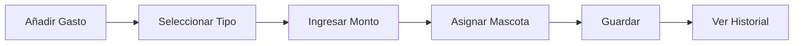
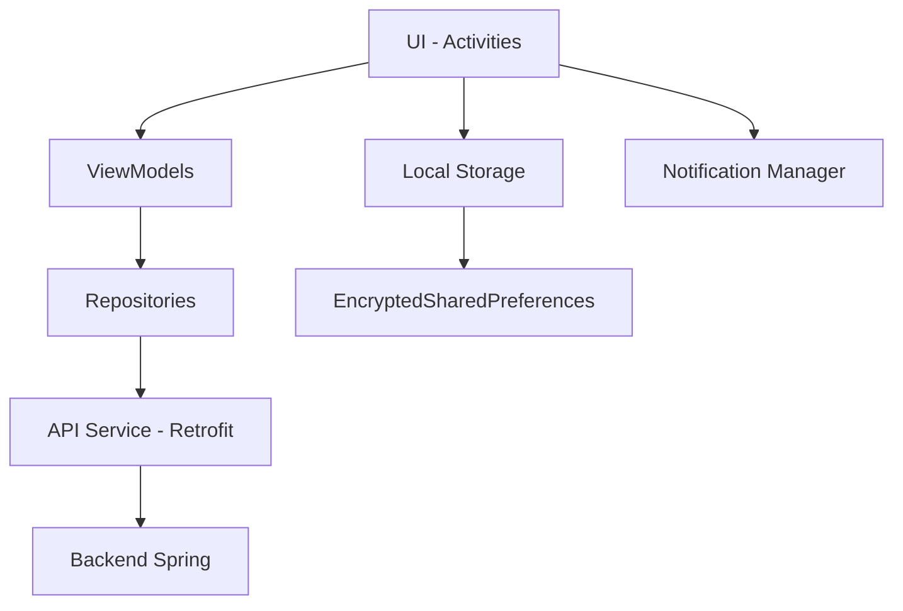

 
# MiVet - Aplicación Android para Gestión Veterinaria

[](https://developer.android.com)
[]()
[]()
[]()

## Tabla de Contenidos
1. [Descripción General](#descripción-general)
2. [Requisitos Técnicos](#requisitos-técnicos)
3. [Instalación y Configuración](#instalación-y-configuración)
4. [Manual del Usuario](#manual-del-usuario)
5. [Manual Técnico](#manual-técnico)
6. [Arquitectura del Sistema](#arquitectura-del-sistema)
7. [Sistema de Notificaciones](#sistema-de-notificaciones)
8. [Colaboración y Extensión](#colaboración-y-extensión)
9. [Futuras Mejoras](#futuras-mejoras)
10. [Licencia](#licencia)

---

## Descripción General
MiVet es una aplicación móvil Android para gestión integral de mascotas y adopciones, diseñada para:
- **Usuarios particulares**: Registrar mascotas, gestionar citas veterinarias, controlar gastos
- **Protectoras de animales**: Gestionar adopciones, administrar perfil institucional
- **Ecosistema completo**: Integrado con backend Spring Boot y API de autenticación Flask

**Funcionalidades clave**:
- 🐾 Registro de mascotas con historial médico
- 📅 Gestión de citas con recordatorios
- 💰 Control de gastos veterinarios
- ❤️ Sistema de adopciones integrado
- 🔐 Autenticación segura JWT
- 🌐 Soporte multi-idioma (ES/EN/PT)
- 📨 Sistema de notificaciones locales

**Diagrama de Arquitectura**:
[App Android] → [Flask Login API] → MySQL
↓
[Spring Boot API] → Base de Datos

---

## Requisitos Técnicos
### Entorno de Desarrollo
- **Android Studio**: Flamingo (2022.2.1) o superior
- **SDK Android**: Mínimo API 24 (Android 7.0)
- **JDK**: 11 o superior

### Dependencias Principales (Gradle)
```gradle
dependencies {
// Retrofit para APIs REST
implementation 'com.squareup.retrofit2:retrofit:2.9.0'
implementation 'com.squareup.retrofit2:converter-gson:2.9.0'

    // Seguridad Android
    implementation "androidx.security:security-crypto:1.1.0-alpha06"
    
    // UI
    implementation 'com.google.android.material:material:1.9.0'
    implementation 'androidx.constraintlayout:constraintlayout:2.1.4'
    
    // Notificaciones
    implementation 'androidx.core:core-ktx:1.12.0'
    implementation 'com.google.android.gms:play-services-base:18.2.0'
}
```

### Servicios Externos Requeridos

| Servicio | URL | Función |
|----------|-----|---------|
| Autenticación (Flask) | https://mivet-login-api.luachea.es | Login/registro |
| API Principal (Spring) | http://13.48.85.87:8080/api/ | Datos de mascotas/citas |

---

## Instalación y Configuración
1. Clonar repositorio
```bash
   git clone https://github.com/TheLexa69/MiVet.git
   cd MiVet
```

2. Configurar entorno en Android Studio
   1. Abrir proyecto en Android Studio
   2. Verificar SDK en local.properties:
```properties
      sdk.dir=/path/to/your/android/sdk
```

3. Configurar endpoints (opcional)
   Si los servidores cambian, actualizar:

```java
   // En ApiClient.java
   public static final String BASE_URL = "http://nueva-ip:puerto/api/";

   // En LoginConnectionClass.java
   private static final String LOGIN_URL = "https://nuevo-dominio-login/login";
```

4. Ejecutar la aplicación
   1. Conectar dispositivo Android (API 24+)
   2. Ejecutar configuración app
   3. Verificar conexión a internet

## Manual del Usuario

### Registro e Inicio de Sesión
**Pantalla de bienvenida**: Seleccione "Registrarse" o "Iniciar sesión"

**Registro**:
1. Complete nombre, email y contraseña
2. Seleccione tipos de mascotas (perro/gato/exótico)
3. Registre cada mascota (nombre, raza, fecha nacimiento)

**Login**:
- Ingrese email y contraseña
- Autenticación automática con token seguro

---

### Menú Principal
**Para usuarios**:
- Perfil de usuario
- Mis mascotas
- Citas veterinarias
- Control de gastos
- Adopciones
- Mensajes

**Para protectoras**:
- Perfil de protectora
- Mascotas en adopción
- Solicitudes de adopción
- Mensajes

---

### Gestión de Mascotas
1. Acceda a "Mis Mascotas"
2. **Añadir mascota**:
   - Nombre, raza, tipo animal
   - Fecha de nacimiento (selector de fecha)
3. **Editar/Eliminar**: Toque largo sobre mascota

---

### Sistema de Adopciones
| Paso | Usuario | Protectora |
|------|---------|------------|
| 1    | Explorar mascotas disponibles | Publicar nuevas mascotas |
| 2    | Enviar solicitud con mensaje | Recibir solicitudes |
| 3    | Recibir notificaciones | Aprobar/rechazar solicitudes |
| 4    | Ver estado en "Mensajes" | Notificar al usuario |

---

### Citas Veterinarias
**Agendar cita**:
1. Seleccione mascota
2. Elija fecha/hora, clínica

**Recordatorios**:
- Notificación automática 1 hora antes
- Gestionar en "Configuración → Notificaciones"

---

### Control de Gastos


---

## Manual Técnico

### Estructura de Paquetes
```
com.mivet.veterinaria/
├── auth/          # Autenticación
├── API/           # Modelos y conexiones
├── notifications/ # Sistema de notificaciones
├── usuario/       # Funcionalidades usuario
├── protectora/    # Funcionalidades protectora
├── helpers/       # Utilidades
└── network/       # Conexiones HTTP
```


 
## Autenticación (JWT)

### Flujo de login:
```java
public class LoginConnectionClass {
public JSONObject login(String email, String password) {
// 1. Crear JSON con credenciales
JSONObject params = new JSONObject();
params.put("email", email);
params.put("password", password);

        // 2. Enviar POST a API Flask
        HttpURLConnection connection = (HttpURLConnection) new URL(LOGIN_URL).openConnection();
        connection.setRequestMethod("POST");
        
        // 3. Procesar respuesta
        if (responseCode == 200) {
            JSONObject response = new JSONObject(responseString);
            if (response.getBoolean("success")) {
                // 4. Guardar token seguro
                saveSecureToken(response.getString("token"));
            }
        }
    }
    
    private void saveSecureToken(String token) {
        EncryptedSharedPreferences pref = EncryptedSharedPreferences.create(
            "secret_shared_prefs",
            MasterKey.AES256_GCM_SPEC,
            context
        );
        pref.edit().putString("AUTH_TOKEN", token).apply();
    }
}
```

---

## API Service (Retrofit)

### Interfaz principal:
```java
public interface ApiService {
// Mascotas
@GET("/api/usuario/mascotas")
Call<List<Mascota>> getMascotasUsuario(@Header("Authorization") String token);

    @POST("/api/usuario/mascotas")
    Call<ResponseBody> crearMascota(@Body PetInfo mascota);
    
    // Citas
    @POST("/api/usuario/citas")
    Call<Cita> crearCita(@Body Cita cita);
    
    // Adopciones
    @POST("/api/adopciones/{idMascota}/solicitar")
    Call<Solicitud> solicitarAdopcion(
        @Path("idMascota") int mascotaId,
        @Query("mensaje") String mensaje
    );
    
    // Protectoras
    @GET("/api/protectora/solicitudes")
    Call<List<Solicitud>> getSolicitudesPendientes();
}
```

---

## Modelos Principales

### Mascota (POJO):
```java
public class Mascota {
private int id;
private String nombre;
private String raza;
private Date fechaNacimiento;
private TipoAnimal tipo; // PERRO, GATO, EXOTICO

    // Getters y Setters
}
```

### Solicitud de Adopción:
```java
public class Solicitud {
    private int id;
    private int idMascota;
    private int idUsuario;
    private EstadoSolicitud estado; // PENDIENTE, APROBADA, RECHAZADA
    private String mensaje;
    private Date fechaSolicitud;
}
```

---

## Arquitectura del Sistema

### Diagrama de Componentes


### Patrón de Diseño
- **Modelo-Vista-Controlador (MVC)**
- Separación clara entre:
   * Capa de presentación (Activities)
   * Lógica de negocio (Repositories)
   * Acceso a datos (Retrofit API)

### Gestión de Dependencias
- **Inyección manual**: No se usa Dagger/Hilt
- **Singleton para clientes API**:
```java
  public class ApiClient {
  private static Retrofit retrofit = null;

  public static Retrofit getClient() {
  if (retrofit == null) {
  retrofit = new Retrofit.Builder()
  .baseUrl(BASE_URL)
  .addConverterFactory(GsonConverterFactory.create())
  .build();
  }
  return retrofit;
  }
  }
```

 
## Sistema de Notificaciones

### Implementación
```java
public class ReceptorRecordatorio extends BroadcastReceiver {
@Override
public void onReceive(Context context, Intent intent) {
// 1. Verificar permisos Android 13+
if (ContextCompat.checkSelfPermission(context, Manifest.permission.POST_NOTIFICATIONS)
!= PackageManager.PERMISSION_GRANTED) {
Log.w("Notificaciones", "Permisos insuficientes");
return;
}

        // 2. Extraer datos de la cita
        String empresa = intent.getStringExtra("EMPRESA");
        String fecha = intent.getStringExtra("FECHA");
        
        // 3. Crear notificación
        NotificationCompat.Builder builder = new NotificationCompat.Builder(context, "canal_citas")
            .setSmallIcon(R.drawable.ic_notification)
            .setContentTitle("Recordatorio de cita")
            .setContentText("Tienes cita en " + empresa + " a las " + fecha)
            .setPriority(NotificationCompat.PRIORITY_HIGH);
        
        // 4. Lanzar notificación
        NotificationManagerCompat manager = NotificationManagerCompat.from(context);
        manager.notify(generateId(), builder.build());
    }
}
```

### Programación de Recordatorios
```java
public void programarRecordatorio(Cita cita) {
Intent intent = new Intent(context, ReceptorRecordatorio.class);
intent.putExtra("EMPRESA", cita.getClinica());
intent.putExtra("FECHA", cita.getHoraFormateada());

    PendingIntent pendingIntent = PendingIntent.getBroadcast(
        context, 
        cita.getId(), 
        intent, 
        PendingIntent.FLAG_IMMUTABLE
    );
    
    AlarmManager alarmManager = (AlarmManager) context.getSystemService(Context.ALARM_SERVICE);
    long triggerAtMillis = cita.getFecha().getTime() - TimeUnit.HOURS.toMillis(1);
    
    alarmManager.setExact(
        AlarmManager.RTC_WAKEUP,
        triggerAtMillis,
        pendingIntent
    );
}
```

---

## Colaboración y Extensión

### Guía de Contribución
1. **Fork** del repositorio
2. Crear rama descriptiva (`feat/nueva-funcionalidad`)
3. Seguir convenciones de código existentes
4. Actualizar documentación
5. Enviar **Pull Request**

### Estructura Recomendada para Nuevas Funcionalidades
```
nueva-funcionalidad/
├── ui/
│   ├── NuevaActivity.java
│   └── activity_nueva.xml
├── viewmodel/
│   └── NuevaFuncionalidadViewModel.java
├── repository/
│   └── NuevaRepository.java
└── model/
    └── NuevoModelo.java
```

---

## Futuras Mejoras

### Roadmap Técnico
| Prioridad | Función                  | Tecnología              |
|-----------|--------------------------|-------------------------|
| Alta      | Caché offline            | Room Database           |
| Alta      | Autenticación social     | Firebase Auth           |
| Media     | Subida de imágenes       | AWS S3/Cloud Storage    |
| Media     | Chat en tiempo real      | WebSockets/Socket.io    |
| Baja      | Geolocalización clínicas | Google Maps API         |

### Optimizaciones Pendientes
- Migrar a Arquitectura MVVM
- Implementar inyección de dependencias (Dagger/Hilt)
- Añadir sistema de logging centralizado
- Implementar Continuous Integration (GitHub Actions)
- Mejorar gestión de errores en capa de red

---

## Licencia
```plaintext
MIT License
Copyright (c) 2023 MiVet Team

Se concede permiso libre de cargos a cualquier persona que obtenga una copia
de este software y de los archivos de documentación asociados (el "Software"),
a utilizar el Software sin restricción, incluyendo sin limitación los derechos
a usar, copiar, modificar, fusionar, publicar, distribuir, sublicenciar,
y/o vender copias del Software, y a permitir a las personas a las que se les
proporcione el Software a hacer lo mismo.
```
 